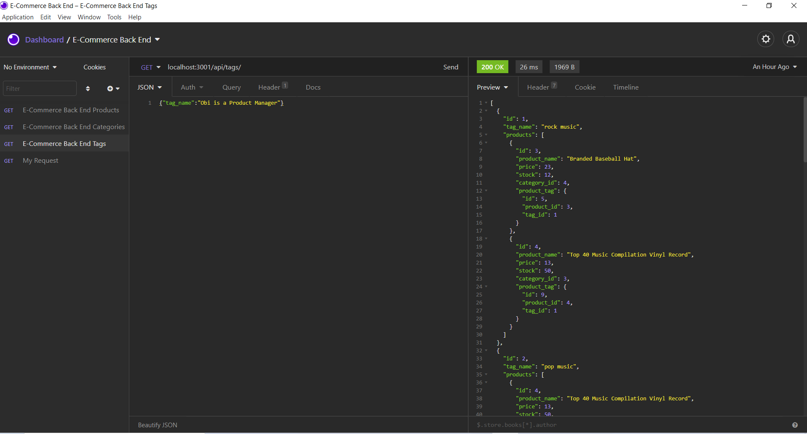

# 11_E-Commerce

* [Acceptance Criteria](#acceptancecriteria)
* [Installation](#installation)
* [Project Status](#projectstatus)
* [License](#license)
* [Deployment](#deployment)
* [Usage](#usage)
* [Preview of the App](#previewApp)

# E-Commerce

For this project, I aim to build the back end for an e-commerce site by modifying starter code. I’ll configure a working Express.js API to use Sequelize to interact with a MySQL database. My main motivation for this project is to provide the manager of the internet retail company a back end for their e-commerce website that uses the latest technologies so that their company can compete with other e-commerce companies.

# Acceptance Criteria
GIVEN a functional Express.js API
WHEN I add my database name, MySQL username, and MySQL password to an environment variable file
THEN I am able to connect to a database using Sequelize
WHEN I enter schema and seed commands
THEN a development database is created and is seeded with test data
WHEN I enter the command to invoke the application
THEN my server is started and the Sequelize models are synced to the MySQL database
WHEN I open API GET routes in Insomnia Core for categories, products, or tags
THEN the data for each of these routes is displayed in a formatted JSON
WHEN I test API POST, PUT, and DELETE routes in Insomnia Core
THEN I am able to successfully create, update, and delete data in my database

# Installation
In order to use this app, you will need to install a working Express.js API to use Sequelize to interact with a MySQL database. In addition, you will need to use the [MySQL2](https://www.npmjs.com/package/mysql2) and [Sequelize](https://www.npmjs.com/package/sequelize) packages to connect to the Express.js API to a MySQL database and the [dotenv](https://www.npmjs.com/package/dotenv) package to use environment variables to store sensitive data.

# Project Status
This project was completed on May 1, 2021. 

# License
MIT

# Deployment
[Link](https://drive.google.com/file/d/1zWecle6rZHCk6TPqthJFXVV--E9M4sOS/view?usp=sharing)

<!-- # Usage
When you open the terminal, you will be able to view all employees, view employees by department and by role, view all departments, add new employees and new Departments, update an employee's information and remove employees.  -->

Add screenShot
# Preview of the App
* This is how the app looks
